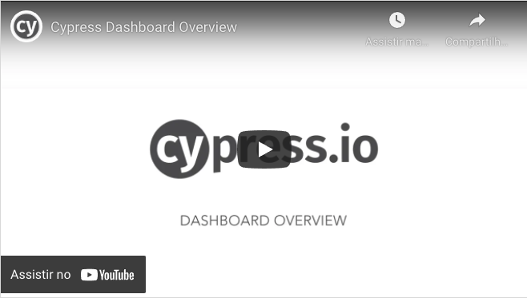

# Template de automação Cypress

Projeto criado para performar testes automatizados utilizando Cypress.

### Tools

Este projeto foi desenvolvido usando:
- **Cypress**: para escrita de código e performar testes;  

## Estrutura do projeto

```
Projeto
|-cypress
│   ├── plugins
│   ├── integration
│   ├── config-files
│   ├── support
│   └── fixtures
├── .gitignore
├── cypress.json
├── package.json
└── README.md
```

# Requirementos

Antes de rodar os testes, tenha certeza de que você possui cypress instalado.  

Execute a seguinte linha de comando, a partir da raiz do seu projeto:  

```
$ npx cypress open
```  

Se o painel de execução do cypress abrir, você já possui o cypress instalado.  
Caso precise instalar do zero para um novo projeto, use o comando: 

```
$ npm install --save-dev cypress
```  

Caso vá reutilizar este template apenas use o comando:
```
$ npm install --save-dev 
```  

## Sobre o Cypress e a construção deste projeto
O Cypress, é um novo test runner com a premissa de testes rápidos, fáceis e confiáveis para qualquer coisa que seja executada em um navegador. 
Neste projeto foi feita uma adaptação para se possa utilizar variáveis de ambiente e diminuir a necessidade de reescrever um mesmo teste.

Seguindo este conceito a pasta **config-files** contém os arquivos, com as variáveis de ambiente, que determinam qual o ambiente deseja rodar os testes (desenvolvimento, homologação ou produção).  

Para que estes arquivos sejam propriamente lidos, se faz necessária a configuração dentro do arquivo **cypress/plugins/index.js** (linha 19 do arquivo em diante).
Uma outra facilidade foi incluída neste projeto, dentro do aquivo **package.json** em *"scripts"*, assim é se possível usar comandos mais curtos e intuitivos para executar os testes.

## Rodando os testes(command line)

Você pode executar os testes a qualquer hora , se estiver na raiz do projeto, usando os seguintes comandos:

**Comando usando o path completo**

```
$ ./node_modules/.bin/cypress open
```  

**Atalho usando npm bin**  (o *$* é necessário antes do parênteses)

```
$ $(npm bin)/cypress open
```  

**Ou usando npx**

*nota: npx já está incluso no npm a partir da versão v5.2.

```
$ npx cypress open
```

Caso queira executar um teste para um ambiente específico:

```
$ npm run cy:env                          
```
**Nota:** *env* é o nome dado ao atalho criado para executar testes no ambiente desejado. Exemplo: *cy:dev*, *cy:prod* ou *cy:hml*.


Caso queira executar um teste específico:

```
$ npm run cy:env --spec "cypress/integration/TesteDesejado.spec.js"                      
```  

**Nota:** *--spec "caminho do teste"* indica ao comando o teste específico que deseja executar.

## Painel
O [Cypress Dashboard](https://dashboard.cypress.io) é um serviço que dá acesso a resultados de teste registrados - normalmente ao executar testes Cypress de seu provedor de CI . O painel fornece uma visão sobre o que aconteceu quando seus testes foram executados.  
[](https://youtu.be/ezp60FUnjGg)  


## Gravando seus testes
O Cypress grava um vídeo para cada arquivo de especificação ao executar testes durante cypress run. Os vídeos não são gravados automaticamente durante *cypress open*.  
A gravação de vídeo pode ser totalmente desligada definindo **video** como false dentro de suas configurações (cypress.json).


## Contribuindo

Contribuições são sempre bem vindas. Todas as contribuições serão analisadas e devidamente apreciadas!

1. Faça um fork do projeto
2. Crie sua feature branch (`git checkout -b feature/AmazingFeature`)
3. Commit suas alterações (`git commit -m 'Add some AmazingFeature'`)
4. Faça um push das suas alterações (`git push origin feature/AmazingFeature`)
5. Abra o Pull Request